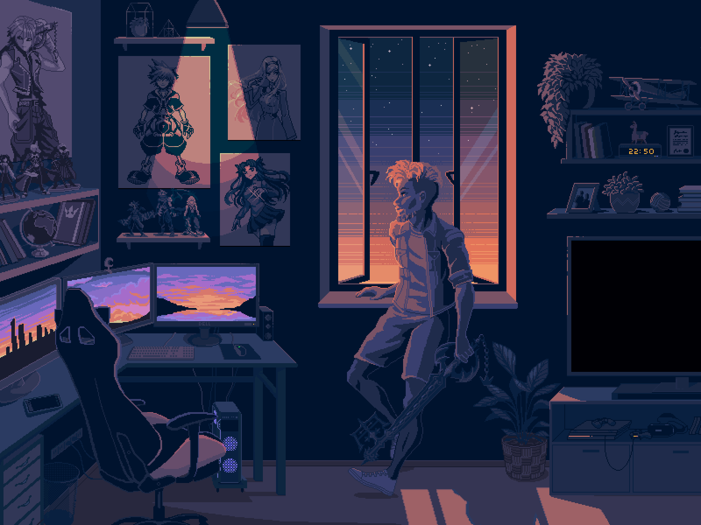

## []  there 👋,

#I'm Yash Rathod-aka LEECHARCH 👽[yash30389](https://yash30389.github.io/yash-Rathod/)
 

<!-- UL -->
* 🧐 I'm just started codeing, And Many more  to come🤗 
* 🌱 I’m currently learning everything 😎  
* 👯 I’m looking to collaborate with other   content creators
* 🥅 2020 Goals:Contribute more to Open Source   projects and also survive to Covid-19🤪  
* ⚡ Fun fact:I love to draw designs and PLAY Songs / drums🤟  

<!-- Blockquote -->
>### Spotify Playing 🎧:

  

<!-- Blockquote -->
>### Connect with me:
[][youtube]
[][twitter]
[][linkedin]
[][instagram]
 

<!-- Blockquote -->
>### Languages and Tools:

 

  
<!-- Blockquote -->
>### YouTube Videos 📺:

<!-- YOUTUBE:START -->
- [PUBG MOBILE 1.2 UPDATE](https://youtu.be/GC6yNJlcDhY)
- [LIBRARY MAP GAME PLAY](https://www.youtube.com/watch?v=kcVJbA9eUSU)
- [PUBG MOBILE 1.0 AERA](https://www.youtube.com/watch?v=9m-XF4QnssE)
- [TDM Game play "THzxLEECHARCH"](https://www.youtube.com/watch?v=z_CPL2icC6E)
<!-- YOUTUBE:END -->

➡️ [more videos...](https://www.youtube.com/channel/UC8FuYJMBPS8PaBE1lQcHUdw)

---

[twitter]: https://twitter.com/YashRathod7722
[youtube]: https://www.youtube.com/channel/UC8FuYJMBPS8PaBE1lQcHUdw
[instagram]: https://www.instagram.com/_yash.rathod/
[linkedin]: https://www.linkedin.com/in/yash-rathod14/
[codepen]: https://codepen.io/yash30389
[github]: https://github.com/yash30389
